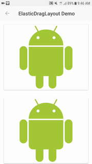

 ElasticDragLayout
===



Checkout the demo code, [link](com/my/demo/elasticdraglayout/SampleOfElasticDragLayoutActivity.kt).

Gradle
---

Add this into your dependencies block.

```
// For gradle < 3.0
compile 'com.my:elastic-drag-layout:1.0.0'

// For gradle >= 3.0
implementation 'com.my:elastic-drag-layout:1.0.0'
```

> The library depends on 
> 
> 1. Support Library > [26.1.0](https://developer.android.com/topic/libraries/support-library/revisions.html#26-1-0)
> 
> 2. Android Gradle Plugin > [3.0.0](https://developer.android.com/studio/releases/gradle-plugin.html#3-0-0) and Kotlin.


If you cannot find the package, add this to your gradle repository

```
maven {
    url 'https://dl.bintray.com/boyw165/android/'
}
```

Wiki
---

### General

An Android *ViewGroup* that supports its child *View* the over-scroll effect like [UICollectionView](https://developer.apple.com/documentation/uikit/uicollectionview) from iOS platform, where the child *View* must implment the [NestedScrollingChild2](https://developer.android.com/reference/android/support/v4/view/NestedScrollingChild2.html) interface.

There are many ways to do the over-scroll effect, one of them is to custom a `RecyclerView` and override the `computeScroll` method; Or to custom a `LayoutManager` to handle the over-scroll. Both ways are focusing on the `RecyclerView` and it might not be that flexible.

This approach supports many descendents of `NestedScrollingChild2`, e.g. `NestedScrollView`, `RecyclerView`, `VerticalGridView`, or `WearableRecyclerView` ...etc, and it's easy by simply enclosing the child *View* with the sepcial *ViewGroup*.

> The library depends on 
> 
> 1. Support Library > [26.1.0](https://developer.android.com/topic/libraries/support-library/revisions.html#26-1-0)
> 
> 2. Android Gradle Plugin > [3.0.0](https://developer.android.com/studio/releases/gradle-plugin.html#3-0-0) and Kotlin.

### Usage

- Enclose your View (which implements the `NestedScrollChild2` interface, for example `RecyclerView`, otherwise it won't work) with the [ElasticDragLayout](com/my/elasticdraglayout/ElasticDragLayout.java).
- Assign the `app:elastic_elasticScrollView` attribute to the View you want to support over-scroll effect.

```
<com.my.elasticdraglayout.ElasticDragLayout
    android:layout_width="match_parent"
    android:layout_height="match_parent"
    app:elastic_dragElasticity="0.98"
    app:elastic_dragOverDistance="344dp"
    app:elastic_dragOverMaxDistance="56dp"
    app:elastic_dragScale="0.99">
    
    <!-- Any view implementing NestedScrollingChild2 -->
    <android.support.v7.widget.RecyclerView
        android:layout_width="match_parent"
        android:layout_height="match_parent"
        android:background="@android:color/white"
        app:elastic_elasticScrollView="true"/>
</com.my.elasticdraglayout.ElasticDragLayout>
```
- Layout attributes for the [ElasticDragLayout](com/my/elasticdraglayout/ElasticDragLayout.java):
	- `app:elastic_dragOverMaxDistance`: The maximum distance the view could be over scrolled in dp.
	- `app:elastic_dragOverDistance`: The over-scroll threshold distance the `onDragOver` callback is called.
	- `app:elastic_dragScale`: The scale of the view when it is at the maximum over-scroll distance. 
	- `app:elastic_dragElasticity`: The level of friction for slowing down the scroll.
	- `app:elastic_overDragOrientation`: The over-scroll orientation and values are:
		- `horizontal`
		- `horizontal_start_only`
		- `horizontal_end_only`
		- `vertical`
		- `vertical_start_only`
		- `vertical_end_only`
- Layout attributes for the child *View*:
	- `app:elastic_elasticScrollView`: A boolean that indicates the [ElasticDragLayout](com/my/elasticdraglayout/ElasticDragLayout.java) to apply this view with the over-scroll effect. Only one is allowed.


License
---

```
Copyright 2017 TAI-CHUN WANG

Permission is hereby granted, free of charge, to any person obtaining a copy of 
this software and associated documentation files (the "Software"), to deal in 
the Software without restriction, including without limitation the rights to use, 
copy, modify, merge, publish, distribute, sublicense, and/or sell copies of the 
Software, and to permit persons to whom the Software is furnished to do so, 
subject to the following conditions:

The above copyright notice and this permission notice shall be included in all 
copies or substantial portions of the Software.

THE SOFTWARE IS PROVIDED "AS IS", WITHOUT WARRANTY OF ANY KIND, EXPRESS OR 
IMPLIED, INCLUDING BUT NOT LIMITED TO THE WARRANTIES OF MERCHANTABILITY, FITNESS 
FOR A PARTICULAR PURPOSE AND NONINFRINGEMENT. IN NO EVENT SHALL THE AUTHORS OR 
COPYRIGHT HOLDERS BE LIABLE FOR ANY CLAIM, DAMAGES OR OTHER LIABILITY, WHETHER 
IN AN ACTION OF CONTRACT, TORT OR OTHERWISE, ARISING FROM, OUT OF OR IN 
CONNECTION WITH THE SOFTWARE OR THE USE OR OTHER DEALINGS IN THE SOFTWARE.
```